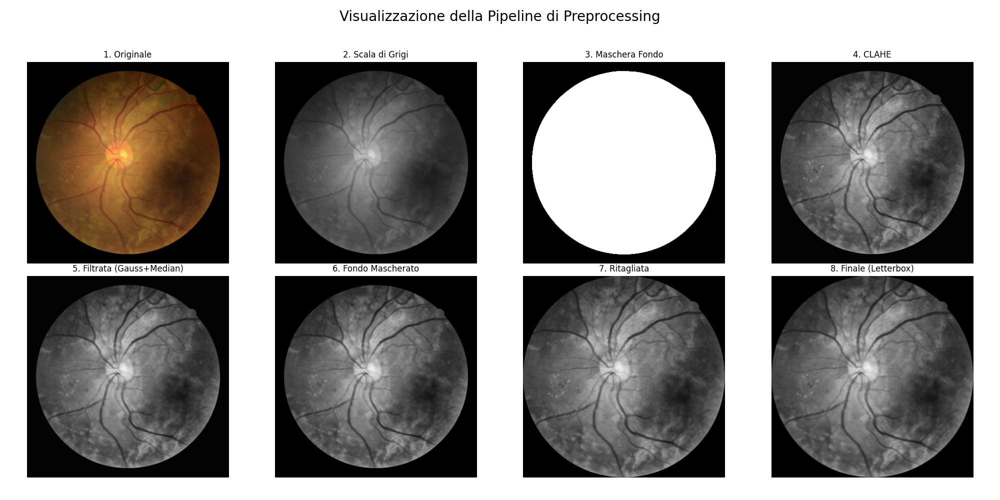

# Diabetic Retinopathy Image Preprocessing Pipeline

This repository contains a Python script for the preprocessing of fundus images from various diabetic retinopathy (DR) datasets. The main goal of this pipeline is to standardize and enhance the images, making them suitable for training a deep learning model for DR classification.

The script processes multiple well-known DR datasets, including IDRiD, APTOS, DeepDRiD, Messidor-2, FGADR, RLDR, and EyePACS. It applies a series of image transformations to isolate the fundus, improve contrast, reduce noise, and normalize the final output.

---

## 🖼️ Preprocessing Pipeline Visualization

The following image illustrates the key stages of the image processing pipeline:

---

## 🔧 Pipeline Steps

The script applies a standardized preprocessing pipeline to every image. This ensures uniformity across different datasets, which is crucial for the performance of a deep learning model.

The core steps are:

1.  **Grayscale Conversion**: The input image (BGR) is converted to grayscale. This simplifies the subsequent processing steps and reduces computational complexity. The conversion uses specific weights for the blue, green, and red channels ($Y' = 0.1140B + 0.5870G + 0.2989R$) to match luminance perception.

2.  **Fundus Segmentation**: The circular area of the fundus is segmented from the black background.
    * The image is blurred using a large Gaussian kernel to smooth it out.
    * A binary threshold is applied to create a preliminary mask.
    * Morphological operations (opening and closing) with elliptical kernels are used to clean up the mask and fill any holes.
    * The largest contour is identified, and its convex hull is computed to create a clean, final mask of the fundus. A bounding box of this mask is also extracted.

3.  **Image Enhancement**: To improve the visibility of retinal features, the following enhancements are applied to the original grayscale image:
    * **Contrast Limited Adaptive Histogram Equalization (CLAHE)**: This enhances local contrast, making features like blood vessels and lesions more distinct without over-amplifying noise.
    * **Gaussian Blur**: A small blur is applied to reduce high-frequency noise.
    * **Median Filter**: This further reduces "salt-and-pepper" noise while preserving the edges of important features.

4.  **Background Masking**: The fundus mask created in Step 2 is applied to the enhanced grayscale image from Step 3. This effectively isolates the preprocessed fundus by setting the background to black.

5.  **Size Normalization & Resizing**: To ensure all images have a consistent scale and size, the following steps are performed:
    * **Cropping**: The masked fundus is cropped using the bounding box from the segmentation step.
    * **Rescaling**: The cropped fundus is resized so that its largest dimension matches a target scale factor (e.g., 90%) of the final image size. This standardizes the relative size of the fundus in each image.
    * **Letterboxing**: The resized fundus is pasted onto a square canvas of the final desired size (e.g., 512x512 pixels) with black padding. This maintains the aspect ratio and ensures all output images have identical dimensions.

6.  **Saving**: The final processed image is saved as a PNG file in a directory corresponding to its diagnostic class.

---

## ⚙️ How to Use

### Prerequisites

Make sure you have the following Python libraries installed:

* OpenCV: `pip install opencv-python-headless`
* NumPy: `pip install numpy`
* Pandas: `pip install pandas`
* Pillow (PIL): `pip install Pillow`
* tqdm: `pip install tqdm`

### Configuration

Before running the script, you need to configure the global parameters and file paths:

1.  **Global Parameters**: In cell `[5]`, you can set the following:
    * `FINAL_IMAGE_SIZE`: The dimension (width, height) for the output images. Default is `(512, 512)`.
    * `FUNDUS_TARGET_SCALE_FACTOR`: Determines how much of the final image the fundus should occupy. Default is `0.9`.
    * `DEBUG_SAVE_INTERMEDIATE`: Set to `True` to save intermediate images from the pipeline for debugging purposes.
    * `DEBUG_OUTPUT_DIR`: The directory where debug images will be saved.

2.  **Dataset Paths**: The script is divided into sections for each dataset (e.g., IDRiD, APTOS). In each section, you must update the following path variables:
    * `csv_path`: The path to the CSV file containing the image labels.
    * `image_dir`: The path to the directory where the raw images are stored.
    * `final_output_dir`: The root directory where the preprocessed images will be saved. The script will automatically create subdirectories for each class.

### Execution

The script is structured as a Jupyter Notebook. You can run the cells sequentially to process each dataset. The progress for each dataset is displayed using a `tqdm` progress bar.

---

## 📂 Script Structure

The script is organized into the following main sections:

* **Imports**: Imports all necessary libraries.
* **Helper Functions**:
    * `compose`: A utility to chain multiple functions together.
    * `letterbox_image`: Resizes an image to a target size by adding padding, thus preserving the aspect ratio.
* **Preprocessing Functions**: Contains the core functions for each step of the pipeline:
    * `convert_to_grayscale`
    * `apply_clahe`
    * `apply_gaussian_blur`
    * `apply_median_filter`
    * `segment_fundus_and_create_mask`
* **Dataset Processing Sections**: Each dataset (IDRiD, APTOS, etc.) has its own dedicated section. This section reads the corresponding CSV file, iterates through the images, applies the full preprocessing pipeline, and saves the output. Each section also includes a "Check" cell to verify the number of processed images per class.
*  **EyePACS and DDR**: This two dataset have a separate folder 
