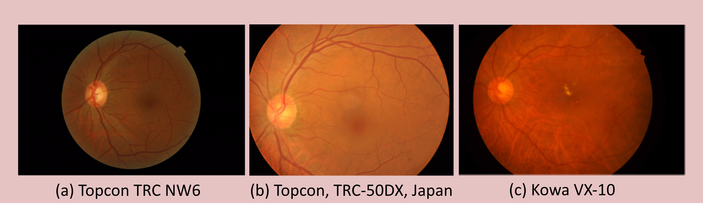
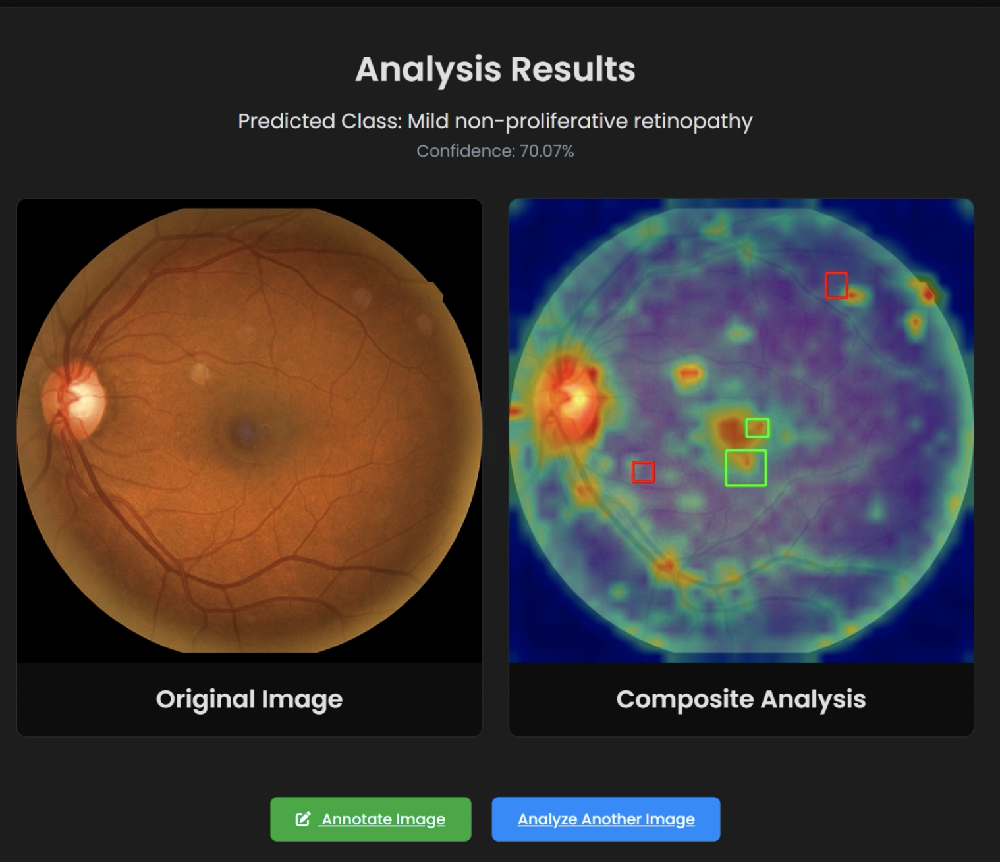

# Self-Supervised Vision Transformers for Trustworthy Cross-Domain Diabetic Retinopathy Classification

**Author**: Giuseppe Genito
[cite_start]**Thesis**: Master's Degree in Computer Science, Data Science and Machine Learning Curriculum [cite: 6, 7]
[cite_start]**University**: University of Salerno [cite: 1]

---

## 🎯 The Challenge: Domain Shift in Medical Imaging

Deep learning models often fail to generalize when tested on data from a "domain" different from the one they were trained on. In the context of retinal imaging, this variability comes from differences in cameras, hospital protocols, and patient demographics.

*Figure: Retinal images from different datasets, captured with different cameras, show significant variability in lighting, zoom, and color, posing a major challenge for AI models*

## 💡 Our Approach: DINOv2 + Explainable AI (XAI)

To overcome this challenge, our approach combines a powerful, pre-trained model with techniques to ensure its decisions are transparent and trustworthy.

1.  **Powerful Feature Extraction with DINOv2**: We use **DINOv2 (ViT-G/14)**, a state-of-the-art Vision Transformer pre-trained using self-supervision on a massive and diverse dataset of 142 million general-purpose images. This allows the model to learn universal visual representations (like textures, edges, and shapes) that are not tied to a specific medical domain, making it inherently more robust to domain shift. We then apply **selective fine-tuning** to adapt this knowledge to the specific task of DR classification.

2.  **Trustworthy and Explainable Predictions**: A key barrier to AI adoption in clinics is the "black box" nature of models. We use the **Attention Rollout** technique to generate heatmaps that visualize exactly which parts of the retinal image the model focused on to make its prediction. This allows clinicians to verify that the model's reasoning aligns with known pathological biomarkers (e.g., microaneurysms, hemorrhages), building trust and turning the AI into a collaborative diagnostic tool.

*Figure: The web application interface shows the original image alongside a composite analysis, which includes an attention heatmap and bounding boxes indicating detected lesions*

---

## 🚀 Project Components

This repository is organized into three main components, each with its own detailed documentation.

### 1. 🖼️ Image Preprocessing Pipeline
A crucial first step was to create a standardized and robust image preprocessing pipeline to handle the variability across datasets. This pipeline ensures that every image fed to the model is consistent in size, quality, and format.

**Key Steps**: Grayscale conversion, fundus segmentation, CLAHE for contrast enhancement, noise reduction, and size normalization with padding to 512x512 pixels.

➡️ **For more details, see the `preprocessing/` directory and its [README.md].**

### 2. 🧠 Model Training & Evaluation
This component contains the scripts for training and evaluating the DinoV2-DR model. The training process uses a **Leave-One-Domain-Out (LODO)** protocol across six datasets to rigorously test the model's generalization capabilities.

**Key Features**: Selective fine-tuning of the DINOv2 backbone, a custom classification head, and evaluation using metrics like AUC, F1-Score, and Accuracy.

➡️ **For more details, see the `model/` directory and its [README.md].**

### 3. 💻 Explainability Web Application
To demonstrate the practical application of our work, we developed an interactive web tool using Flask. This application allows a user to upload a retinal fundus image and receive not only a classification of its DR stage but also a visual explanation of the model's decision-making process.

**Key Features**: DR classification, attention map generation [cite: 669][cite_start], and a "lesion hit-analysis" that compares the model's focus areas with ground-truth lesion masks.

➡️ **For more details, see the `application/` directory and its [README.md].**

---
## 📊 Key Results

Our proposed **DinoV2-DR** model significantly outperforms existing state-of-the-art methods on the GDRBench generalization benchmark across all major metrics.

| Model | Average AUC | Average Accuracy | Average F1-Score |
| :--- | :---: | :---: | :---: |
| GDRNet | 82.60% | 52.5% | 43.5% |
| CLIP-DR  | 82.72% | - | 45.5% |
| MIL-ViT  | 81.9% | 51.7% | 41.0% |
| GAD  | 83.3% | 57.4 | 44.6% |
| **DinoV2-DR (Ours)** | **85.73%** | **63.47%** | **50.15%** |

---
